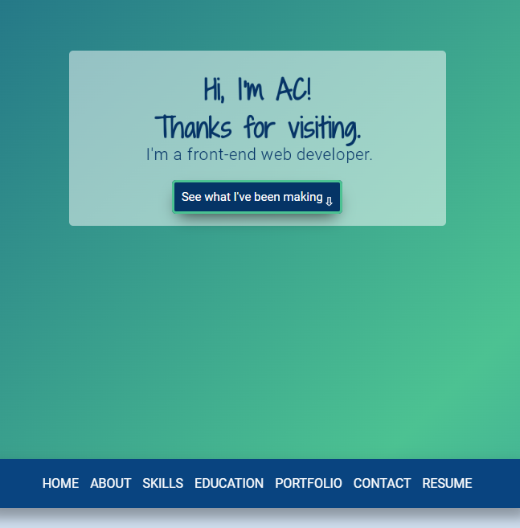

[![Netlify][netlify-status]][netlify-url]
![last commit][last-commit]
![issues open][issues-open]
![github stars][stars]

<h1><strong>ACHulslander.com</strong></h1>
<h3>Personal website, portfolio with projects, education and skills</h3>

This is my personal website build with ReactJS and SCSS, hosted on <a href='https://www.netlify.com'>Netlify</a>.  I've spent countless hours developing this site and pushed myself beyond my skills to add aspects that, while they may not be the most noticeable, were important to me and ended up in my toolbox (who knew tool-tips were such a pain?).  I developed it with a11y in mind and from a mobile-first standpoint.  This is the second version of my portfolio, and the fifth iteration of this version.  As I learned more working on other projects and studying, I came back and incorporated that knowledge into this site.  As a result, I've been able to cut out well over a thousand lines of code and ended up with much cleaner and readable code.  It may not the the flashiest website of a developer, but it scores well with Lighthouse (Google analytics dings the score, as always) and loads quickly, two more important factors to me.

Visit: <a href='https://www.achulslander.com'>achulslander.com</a>

Repo: <a href='https://github.com/alleycaaat/achulslander.com'>https://github.com/alleycaaat/achulslander.com</a>

 

  
Table of Contents

  <ul>
    <li>
        <a href='#about-the-project'>About The Project</a></li>
    <ul>
        <li><a href='#features'>Features</a></li>
        <li><a href='#built-with'>Built With</a></li>
        <li><a href='#tested-on'>Tested On</a></li>
    </ul>
    <li><a href='#feedback'>Feedback</a></li>
    <li><a href='#contact'>Contact</a></li>
    <li><a href='#acknowledgements'>Acknowledgements</a></li>
  </ul>

 

## <strong>About The Project</strong>

 

![repo size][repo-size]
![language count][language-count]
![main language][main-language]

### <strong>Features</strong>
- Media queries for a responsive design
- Developed for mobile screen first
- Sticky navigation bar on large screens
- Collapsible side navigation on small screens
- section navigation with the useRef Hook
- REST API to retrieve Hashnode posts
- Modal feature for viewing portfolio pieces
- Various elements slide into view upon scrolling
- Tooltips on hover on icons
- Smooth scrolling only when needed to prevent modal issues
- A photo of a cute horse

 

### <strong>Built With</strong>

[![React][react.js]][react-url]
[![Sass][sass]][sass-url]

 

### <strong>Tested On</strong>

[![Chrome][chrome]][chrome-url]
[![Opera][opera]][opera-url]
[![Firefox][firefox]][firefox-url]

(<a href='#top'>back to top</a>)

## <strong>Feedback</strong>

As my cats and dog aren't too keen on providing input on my projects, feel free to [send me a message](https://www.achulslander.com/#contact) if you have some constructive comments, or [file an issue](https://github.com/alleycaaat/achulslander.com/issues/new) if I really buggered something up.

 

## <strong>Contact</strong>

AC Hulslander - [Send me a message](https://www.achulslander.com/#contact)

[![GitHub][github]](https://github.com/alleycaaat/)
[![hashnode][hashnode]][hashnode-url]
[![linkedin][linkedin]][linkedin-url]
[![discord][discord]][discord-url]
[![codepen][codepen]][codepen-url]
[![twitter][twitter]][twitter-url]

 

## <strong>Acknowledgements</strong>

- [React Icons](https://react-icons.github.io/react-icons/)
- [Img Shields](https://shields.io/)
- [Icons8](https://icons8.com/)

(<a href='#top'>back to top</a>)

[netlify-status]:https://api.netlify.com/api/v1/badges/49e4983e-66c6-469e-a026-cd9b75443b4f/deploy-status
[netlify-url]:https://app.netlify.com/sites/achulslander-portfolio/deploys

[issues-open]: https://img.shields.io/github/issues/alleycaaat/achulslander.com?color=blue&logo=github

[repo-size]: https://img.shields.io/github/repo-size/alleycaaat/achulslander.com?color=red&logo=github

[language-count]: https://img.shields.io/github/languages/count/alleycaaat/achulslander.com?color=orange&logo=github

[main-language]: https://img.shields.io/github/languages/top/alleycaaat/achulslander.com?color=yellow&logo=github

[last-commit]: https://img.shields.io/github/last-commit/alleycaaat/achulslander.com?logo=github

[stars]: https://img.shields.io/github/stars/alleycaaat/achulslander.com?color=purple&logo=github

[linkedin]: https://img.shields.io/badge/-LinkedIn-black.svg?style=for-the-badge&logo=linkedin&colorB=555
[linkedin-url]: https://linkedin.com/in/achulslander

[product-screenshot]: images/screenshot.png

[react.js]: https://img.shields.io/badge/React-20232A?style=for-the-badge&logo=react&logoColor=61DAFB
[react-url]: https://reactjs.org/

[netlify]: https://img.shields.io/badge/Netlify-00C7B7?style=for-the-badge&logo=netlify&logoColor=white
[netlify-url]: https://netlify.com

[sass]: https://img.shields.io/badge/Sass-CC6699?style=for-the-badge&logo=sass&logoColor=white
[sass-url]: https://sass-lang.com/

[chrome]: https://img.shields.io/badge/Google_chrome-4285F4?style=for-the-badge&logo=Google-chrome&logoColor=white
[chrome-url]: https://www.google.com/chrome/

[opera]: 	https://img.shields.io/badge/Opera-FF1B2D?style=for-the-badge&logo=Opera&logoColor=white
[opera-url]: https://www.opera.com/download

[firefox]: https://img.shields.io/badge/Firefox_Browser-FF7139?style=for-the-badge&logo=Firefox-Browser&logoColor=white
[firefox-url]: https://www.mozilla.org/en-US/firefox/

[github]: https://img.shields.io/badge/GitHub-100000?style=for-the-badge&logo=github&logoColor=white

[codepen]: https://img.shields.io/badge/Codepen-000000?style=for-the-badge&logo=codepen&logoColor=white
[codepen-url]: https://codepen.io/alleycaaat

[twitter]: https://img.shields.io/badge/Twitter-1DA1F2?style=for-the-badge&logo=twitter&logoColor=white
[twitter-url]: https://twitter.com/achulslander

[hashnode]: https://img.shields.io/badge/Hashnode-2962FF?style=for-the-badge&logo=hashnode&logoColor=white
[hashnode-url]: https://hashnode.com/@alleycaaat

[discord]:https://img.shields.io/badge/Discord-7289DA?style=for-the-badge&logo=discord&logoColor=white
[discord-url]: https://discord.com/users/427569685366833174
